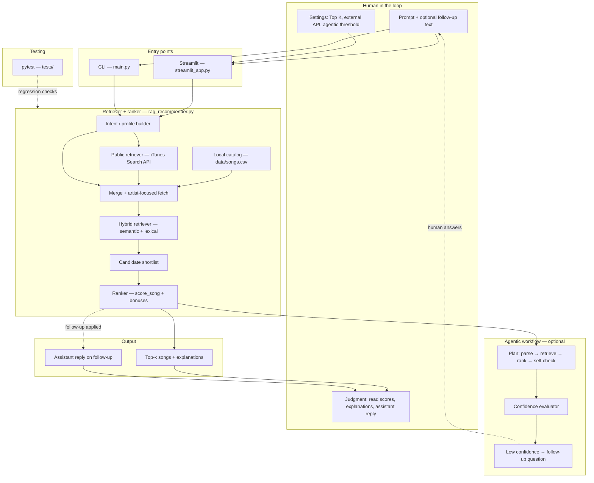
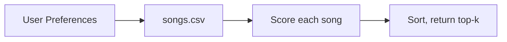
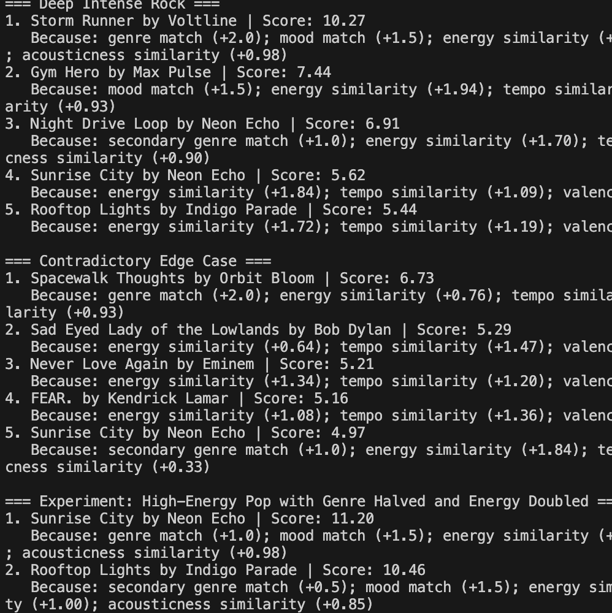

# Music Recommender: Rules-Based Core + Prompt-Driven RAG

## Repository

**GitHub:** https://github.com/samrakshanadhikari/-applied-ai-system-project

---

## Original project (Modules 1–3)

**Repository name:** [samrakshanadhikari / **ai110-module3show-musicrecommendersimulation-starter**](https://github.com/samrakshanadhikari/ai110-module3show-musicrecommendersimulation-starter) (CodePath module 3 showpiece—**Music Recommender Simulation** starter, extended locally).

**What it did (2–3 sentences):** That project was a **CLI-first, content-based recommender**. It loaded songs from **`data/songs.csv`**, compared each track to several **fixed taste profiles** (genre, mood, energy, tempo, valence, danceability, acousticness), computed a **weighted total score** plus a **short explanation** for every song, and printed the **top-k** recommendations. The goal was to learn how transparent scoring rules behave across different listeners—not to build a production recommender.

**This final repo** keeps that scoring core (`src/recommender.py`, `python -m src.main` profile demo) and extends it with **RAG**, **Streamlit**, **agentic** self-check, and **tests** described below.

---

## Title and summary: what this does and why it matters

**What it does today:** Users describe what they want in **natural language** (or use the original **profile demo**). The system **retrieves** relevant tracks from a **merged catalog** (local CSV + **iTunes Search API**), **shortlists** candidates with **hybrid retrieval** (pretrained **sentence-transformer** embeddings plus lexical overlap), then **ranks** them with the same transparent scoring engine and returns **top-k songs with explanations**. An optional **agentic** layer **estimates confidence** and can **ask a clarifying question** or accept **follow-up** text; the UI can show a short **assistant summary** of how follow-up was interpreted.

**Why it matters:** It demonstrates an **applied AI** pattern suitable for portfolios and interviews—**retrieval-augmented** recommendations (answers grounded in fetched catalog data), **guardrails** (validation, logging, fallbacks), **testability**, and **explainability**—without claiming to train a custom generative model.

---

## Architecture overview

The **system diagram** below is the main map of the codebase: **humans** enter prompts and settings through **Streamlit** or the **CLI**; **intent** becomes a numeric profile; **retrieval** expands beyond the tiny CSV using a public API and **deduplication**; **hybrid** retrieval fuses semantics and keywords; **ranking** adds retrieval bonuses, **artist preference**, and optional **follow-up directives**; an optional **agent** runs **plan → retrieve → rank → self-check** and may surface uncertainty through a **follow-up question**. **pytest** provides automated regression checks.

The **Mermaid diagram** below satisfies the “architecture in README” requirement. **Optionally** also save a PNG into **`assets/system-architecture.png`** for slides or graders who want an image file—copy [`assets/MERMAID_ARCHITECTURE_FOR_EXPORT.mmd`](assets/MERMAID_ARCHITECTURE_FOR_EXPORT.mmd) into [Mermaid Live](https://mermaid.live) and export.



**Code map:** `src/recommender.py` (CSV + `score_song`), `src/rag_recommender.py` (RAG + agentic), `src/streamlit_app.py` (UI), `src/main.py` (CLI). Logs: `logs/app.log`.

---

## Setup instructions

1. **Clone** this repo and `cd` into it.

2. **Virtual environment** (recommended):

   ```bash
   python -m venv .venv
   source .venv/bin/activate
   ```

   Windows: `.venv\Scripts\activate`

3. **Install:**

   ```bash
   pip install -r requirements.txt
   ```

4. **Optional — SSL (some macOS/Python installs):** if iTunes calls fail with certificate errors:

   ```bash
   export SSL_CERT_FILE=$(python -c "import certifi; print(certifi.where())")
   export REQUESTS_CA_BUNDLE="$SSL_CERT_FILE"
   ```

5. **Verify tests:**

   ```bash
   pytest
   ```

---

## Running the system

| Mode | Command |
|------|---------|
| **Web UI** | `streamlit run src/streamlit_app.py` |
| **Profile demo** (Modules 1–3) | `python -m src.main` |
| **Single prompt** | `python -m src.main --prompt "I want calm acoustic songs for late-night focus"` |
| **Interactive** | `python -m src.main --interactive` |
| **Agentic CLI** | `python -m src.main --interactive --agentic` |
| **Local only** | add `--no-external` |
| **Lexical only** (no embeddings) | add `--lexical-only` |

---

## Sample interactions

*Live iTunes titles vary by region; local CSV rows are fixed.*

1. **Study / calm:** Prompt: *“I need calm acoustic music for studying.”* → Derived profile favors low energy / higher acousticness; top picks often include lofi/folk-like CSV rows with clear explanation strings.

2. **Artist + vibe:** Prompt: *“I want Eminem struggling songs.”* → Many **Eminem** tracks after merge; explanations show **requested artist match** and **retrieval relevance**; agent may ask for **chill vs intense vs reflective** if confidence is low.

3. **Follow-up:** Prompt: *“I need J Cole love songs”* + follow-up: *“I don’t think Intro is his love song. Prefer She’s Mine.”* → Parsed avoid/prefer → **assistant reply** + **re-ranked** list.

---

## Design decisions and trade-offs

| Decision | Rationale | Trade-off |
|----------|-----------|-----------|
| **RAG, not custom training** | Credible for coursework; retrieval-grounded answers | Depends on API + catalog |
| **Hybrid semantic + lexical** | Robust for names and rare words | More tuning surface |
| **Rule-based intent** | Explainable | Misses subtle emotion without more vocabulary |
| **iTunes** | Free, broad | Metadata ≠ perfect mood labels |
| **Agent = confidence + question** | Self-check without tool sprawl | Not a full autonomous agent |

---

## Reliability and evaluation

### Testing summary

- **What worked:** **`pytest`** (**17 / 17** tests) covers CSV scoring, prompt → profile, **hybrid** retrieval with a **stub** embedder, **mocked** iTunes payloads, artist prioritization, follow-up directives, question-style follow-ups, strict-artist enrichment, and **agentic** low-confidence paths. End-to-end **Streamlit** and **CLI** runs match expectations when external retrieval and SSL are healthy.

- **What didn’t / was brittle:** **SSL certificate** trust on some Mac/Python installs broke iTunes calls until **certifi** or env vars fixed it. **Live iTunes** results vary by **region** and time—tests avoid asserting exact titles. **Intent + follow-up** parsing needed several iterations (e.g. questions mistaken for commands, **“only artist”** with a thin catalog).

- **What I learned:** Most “AI” failures were **data + intent** issues, not the embedding math—**logging**, **diagnostics in the UI**, and **regression tests** matter as much as model choice.

**More detail:** **Confidence** (~0.5–0.9 typical) blends top-score strength, margin to #2, and shortlist depth; **vague** prompts often fall **below** the default **0.70** threshold → **follow-up**. **Guardrails:** empty prompt rejection; API/SSL/embed fallbacks; `logs/app.log`; Streamlit error handling.

---

## Reflection

**What this project taught me about AI and problem-solving:** “AI” here was mostly **orchestration**—retrieval, rules, and **explainable** scoring—rather than training a giant model from scratch. The hard part was making **language** (prompts and follow-ups) line up with **behavior** users expect. I learned that **edge cases** expose design flaws faster than averages, and that **tests + logs + a UI** turn those edge cases into fixes instead of mysteries.

**Responsible AI** (limitations, misuse, collaboration): **[reflection.md](reflection.md)**. Limitations, bias, evaluation: **[model_card.md](model_card.md)**.

---

## Presentation and portfolio

### Loom walkthrough (required for grading)

**My recording:** [Watch my demo](https://www.loom.com/share/e404dd2a655e4ea2bd218a88c36d0d38)

**What the video should show (per rubric):** *No installation or file-tree tour required.*

| Must show | Suggestion |
|-----------|------------|
| **End-to-end run, 2–3 inputs** | e.g. calm study prompt → artist prompt → follow-up refinement in Streamlit |
| **AI feature behavior** | Call out **RAG** (external + local), **hybrid retrieval**, and **agentic** confidence + follow-up |
| **Reliability / evaluation** | e.g. **confidence** below threshold + question, empty prompt warning, or toggle **local-only** after describing fallback |
| **Clear outputs** | Zoom **derived profile**, **top matches + explanations**, and **diagnostics** (external count, retrieval strategy) |

Keep total length **about 5–7 minutes** for a live presentation companion.

### What this project says about me as an AI engineer

I care about **systems that can be trusted and debugged**: I grounded recommendations in **retrieval**, added **tests** for the tricky parsing and ranking paths, and shipped a **UI** so non-developers can stress the same flows. I’m comfortable combining **pretrained models** with **rules and guardrails**, and I default to **measuring and logging** instead of assuming the demo always works.

### Submission checklist

- [ ] Code pushed to the correct **public** GitHub repo: https://github.com/samrakshanadhikari/-applied-ai-system-project
- [ ] Functional code, **README.md**, **model_card.md**, architecture diagram (**in README and/or** `assets/system-architecture.png`).
- [ ] **`assets/`** populated (screenshots + optional `system-architecture.png`; see [`assets/SUBMISSION_CHECKLIST.md`](assets/SUBMISSION_CHECKLIST.md)).
- [ ] **Loom** link in README is set and covers **all** rubric bullets.
- [ ] **Meaningful commit history** (feature-sized commits, not one giant dump).
- [ ] **model_card.md** addresses **AI collaboration**, **biases**, and **testing** (see updated sections there).
- [ ] Final push before the deadline.

---

## Appendix: scoring recipe (content-based core)

- `+2.0` favorite genre · `+1.0` secondary · `+1.5` mood · up to `+2.0` energy · up to `+1.5` tempo · up to `+1.5` valence · up to `+1.0` danceability · up to `+1.0` acousticness. RAG adds retrieval, artist, and follow-up bonuses.

### Legacy flow (profile-only)



### Screenshots (`assets/`)

Static demos (also show 2–3 live inputs in your **Loom**).





