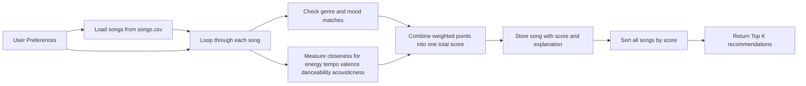

# 🎵 Music Recommender Simulation

## Project Summary

This project builds a CLI-first music recommender that scores songs from a CSV catalog against different user taste profiles. It uses genre, mood, energy, tempo, valence, danceability, and acousticness to rank songs, explain why they matched, and compare how the system behaves across very different listeners.

---

## How The System Works

Real-world recommendation systems often combine large amounts of user behavior data, such as likes, skips, playlists, and listening history, with content information about the songs themselves. At scale, platforms like Spotify or YouTube may use collaborative filtering to learn from patterns across many users and content-based filtering to compare item attributes. My simulation focuses on the content-based side: it compares a user's preferred music traits to each song's attributes, gives higher scores to songs that are closer to the user's preferred vibe, and then ranks songs from best match to worst match.

Features used in this simulation:

- `Song` features: `genre`, `mood`, `energy`, `tempo_bpm`, `valence`, `danceability`, `acousticness`
- `UserProfile` features: `favorite_genre`, `secondary_genre`, `favorite_mood`, `target_energy`, `target_tempo_bpm`, `target_valence`, `target_danceability`, `target_acousticness`

The recommender now tests multiple profiles, including reflective hip-hop and folk, high-energy pop, chill lofi, deep intense rock, and one contradictory edge case. For each profile, it loops through every song in `data/songs.csv`, calculates a score, and returns the top `k` songs with the highest scores.

### Data Flow



### Algorithm Recipe

- `+2.0` points for a match with `favorite_genre`
- `+1.0` point for a match with `secondary_genre`
- `+1.5` points for a match with `favorite_mood`
- Up to `+2.0` points for how close the song's `energy` is to `target_energy`
- Up to `+1.5` points for how close `tempo_bpm` is to `target_tempo_bpm`
- Up to `+1.5` points for how close `valence` is to `target_valence`
- Up to `+1.0` point for how close `danceability` is to `target_danceability`
- Up to `+1.0` point for how close `acousticness` is to `target_acousticness`

For the numerical features, the scoring rule rewards closeness rather than simply giving more credit to larger values. A song gets more points when its feature value is nearer to the user's target value, and fewer points when it is farther away. After every song receives a total score, the system applies a ranking rule by sorting the catalog from highest score to lowest score and recommending the top results.

### Potential Biases

- This system may over-prioritize genre and miss songs from other genres that still match the user's mood and vibe.
- A fixed user profile can be too static, even though real musical taste changes across time, context, and emotion.
- The dataset is small, so the recommender can only choose from a narrow slice of music.
- The system does not understand lyrics, storytelling, or personal meaning, which matter a lot for songs like reflective hip-hop and folk.

---

## Getting Started

### Setup

1. Create a virtual environment (optional but recommended):

   ```bash
   python -m venv .venv
   source .venv/bin/activate      # Mac or Linux
   .venv\Scripts\activate         # Windows

2. Install dependencies

```bash
pip install -r requirements.txt
```

3. Run the app:

```bash
python -m src.main
```

### Running Tests

Run the starter tests with:

```bash
pytest
```

You can add more tests in `tests/test_recommender.py`.

---

## Experiments You Tried

- Tested five profiles: Reflective Hip-Hop / Folk, High-Energy Pop, Chill Lofi, Deep Intense Rock, and a Contradictory Edge Case.
- Ran a weight-shift experiment where genre was cut in half and energy was doubled for the High-Energy Pop profile.
- Compared whether the results felt intuitive or if the scoring logic could be tricked by conflicting preferences.

---

## Limitations and Risks

- It only works on a tiny catalog, so some profiles will see the same songs repeatedly.
- Genre bonuses can overpower other signals, especially for edge-case users.
- It does not understand lyrics, storytelling, or personal associations with songs.

You will go deeper on this in your model card.

---

## Reflection

Read `model_card.md` and `reflection.md`:

[**Model Card**](model_card.md)
[**Reflection Notes**](reflection.md)

Building the recommender made it much easier to see how recommendation systems turn preference data into rankings. A few carefully chosen weights can make the results feel smart for normal users, but edge cases quickly show where the logic is brittle.

The most important lesson from Phase 4 was that explanation matters. When the CLI prints the score and the reasons, it becomes much easier to see why a song ranked highly and where the recommender may be biased or overly rigid.


---

## Example Terminal Output

This screenshot shows the recommender running in the terminal.


## Evaluation Screenshots

This first screenshot shows the recommender output through the Chill Lofi profile.


This second screenshot shows the Deep Intense Rock profile and the remaining evaluation output.


