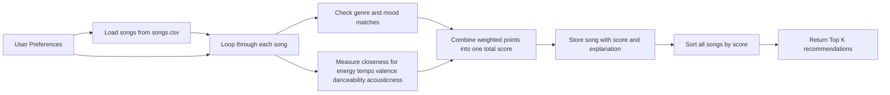

# 🎵 Music Recommender Simulation

## Project Summary

In this project you will build and explain a small music recommender system.

Your goal is to:

- Represent songs and a user "taste profile" as data
- Design a scoring rule that turns that data into recommendations
- Evaluate what your system gets right and wrong
- Reflect on how this mirrors real world AI recommenders

Replace this paragraph with your own summary of what your version does.

---

## How The System Works

Real-world recommendation systems often combine large amounts of user behavior data, such as likes, skips, playlists, and listening history, with content information about the songs themselves. At scale, platforms like Spotify or YouTube may use collaborative filtering to learn from patterns across many users and content-based filtering to compare item attributes. My simulation focuses on the content-based side: it compares a user's preferred music traits to each song's attributes, gives higher scores to songs that are closer to the user's preferred vibe, and then ranks songs from best match to worst match.

Features used in this simulation:

- `Song` features: `genre`, `mood`, `energy`, `tempo_bpm`, `valence`, `danceability`, `acousticness`
- `UserProfile` features: `favorite_genre`, `secondary_genre`, `favorite_mood`, `target_energy`, `target_tempo_bpm`, `target_valence`, `target_danceability`, `target_acousticness`

The current sample user profile is a reflective listener who prefers hip-hop first, folk second, lower energy songs, moderate tempo, lower valence, and a fairly acoustic sound. The recommender will read the user's preferences, loop through every song in `data/songs.csv`, calculate a score for each song, and return the top `k` songs with the highest scores.

### Data Flow



### Algorithm Recipe

- `+2.0` points for a match with `favorite_genre`
- `+1.0` point for a match with `secondary_genre`
- `+1.5` points for a match with `favorite_mood`
- Up to `+2.0` points for how close the song's `energy` is to `target_energy`
- Up to `+1.5` points for how close `tempo_bpm` is to `target_tempo_bpm`
- Up to `+1.5` points for how close `valence` is to `target_valence`
- Up to `+1.0` point for how close `danceability` is to `target_danceability`
- Up to `+1.0` point for how close `acousticness` is to `target_acousticness`

For the numerical features, the scoring rule rewards closeness rather than simply giving more credit to larger values. A song gets more points when its feature value is nearer to the user's target value, and fewer points when it is farther away. After every song receives a total score, the system applies a ranking rule by sorting the catalog from highest score to lowest score and recommending the top results.

### Potential Biases

- This system may over-prioritize genre and miss songs from other genres that still match the user's mood and vibe.
- A fixed user profile can be too static, even though real musical taste changes across time, context, and emotion.
- The dataset is small, so the recommender can only choose from a narrow slice of music.
- The system does not understand lyrics, storytelling, or personal meaning, which matter a lot for songs like reflective hip-hop and folk.

---

## Getting Started

### Setup

1. Create a virtual environment (optional but recommended):

   ```bash
   python -m venv .venv
   source .venv/bin/activate      # Mac or Linux
   .venv\Scripts\activate         # Windows

2. Install dependencies

```bash
pip install -r requirements.txt
```

3. Run the app:

```bash
python -m src.main
```

### Running Tests

Run the starter tests with:

```bash
pytest
```

You can add more tests in `tests/test_recommender.py`.

---

## Experiments You Tried

Use this section to document the experiments you ran. For example:

- What happened when you changed the weight on genre from 2.0 to 0.5
- What happened when you added tempo or valence to the score
- How did your system behave for different types of users

---

## Limitations and Risks

Summarize some limitations of your recommender.

Examples:

- It only works on a tiny catalog
- It does not understand lyrics or language
- It might over favor one genre or mood

You will go deeper on this in your model card.

---

## Reflection

Read and complete `model_card.md`:

[**Model Card**](model_card.md)

Write 1 to 2 paragraphs here about what you learned:

- about how recommenders turn data into predictions
- about where bias or unfairness could show up in systems like this


---

## Example Terminal Output

This screenshot shows the recommender running with my custom reflective hip-hop and folk user profile.


